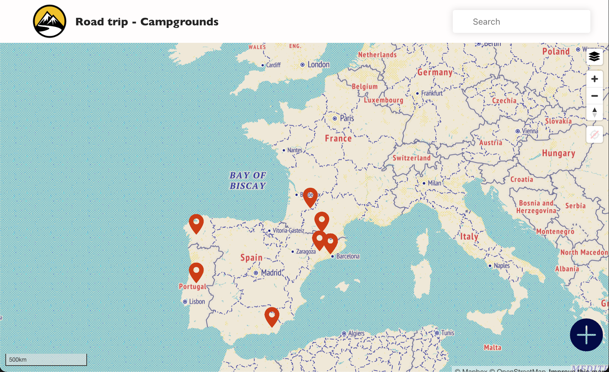
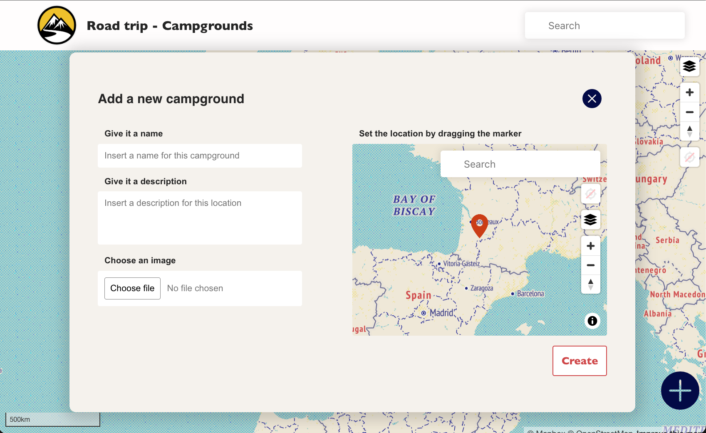
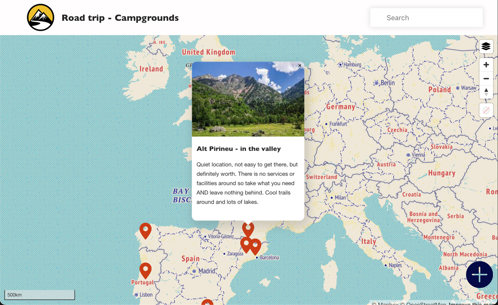

# Road Trip - Campgrounds

Road Trip is made for users to find places where they can set camp or park a van and spend the night or a few days.
Users can also add campgrounds they discovered and share it with others.


<p align="center" display="flex" gap="3px">
  
  
  

</p>


## Getting started

#### 1. Run npm install in both the server and client folders

```
npm install
```


#### 2. Turn on the server

```
nodemon index.js
```
- make sure you are in the server folder


#### 3. Run the React client from another terminal

``` 
npm start
```
- make sure you are in the client folder


## Tech Stack

### Front End

- [React](https://reactjs.org/) - Main front end framework
- [Mapbox](https://www.mapbox.com/) - Mapbox GL JS library for maps

### Backend End

- [Express](https://expressjs.com/) - Backend framework for Node.js
- [MongoDB](https://www.mongodb.com/) - Database and Atlas for DB hosting
- [Mongoose](https://mongoosejs.com/) - Mongo ODM

## Features

  - Users can explore the main map, find campgrounds and see detailed information about those
  - Users can add campgrounds they discovered
  
  * campgrounds are places where it's suitable to set camp or park a van and spend the night or a few days


## Author

Ana Ferrari Firmo - [Github](https://github.com/aferrarifirmo) - [LinkedIn](https://www.linkedin.com/in/ana-ferrari-firmo)

